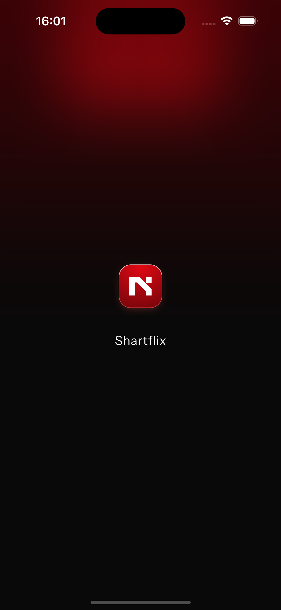
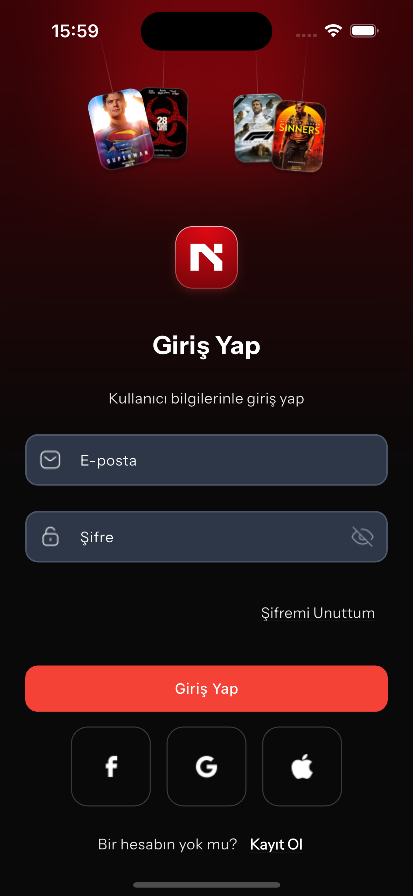
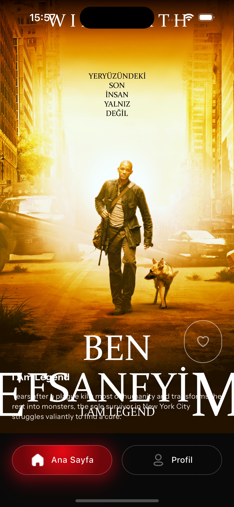
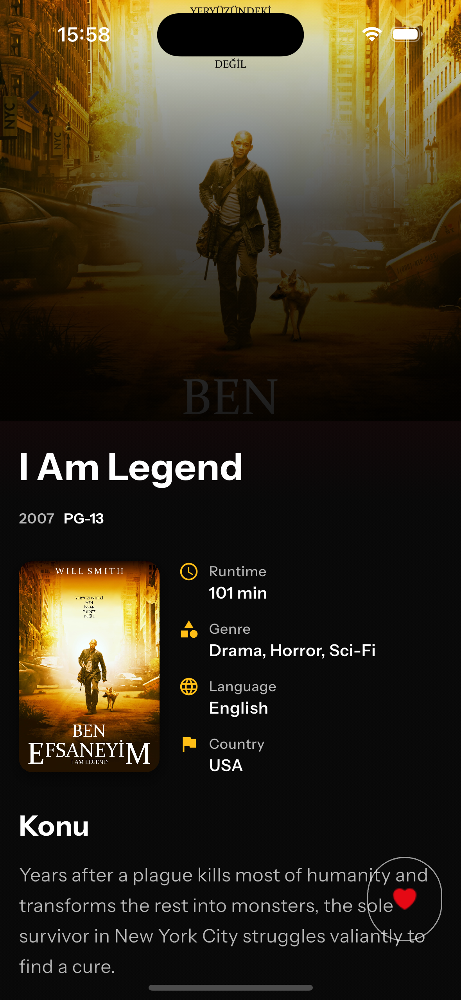
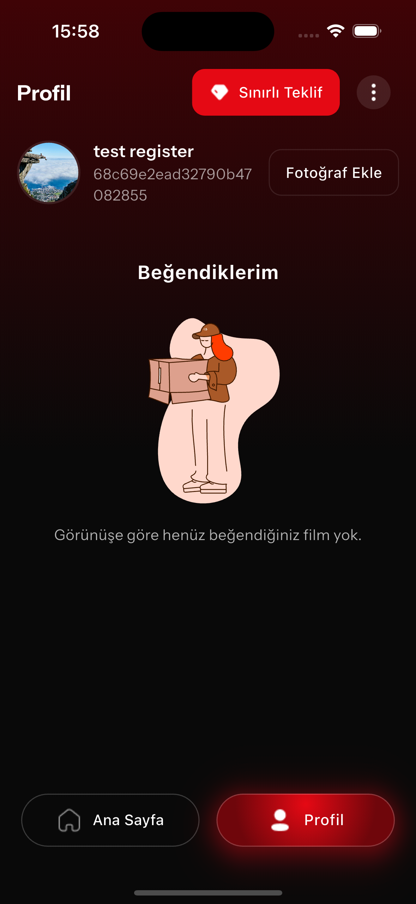
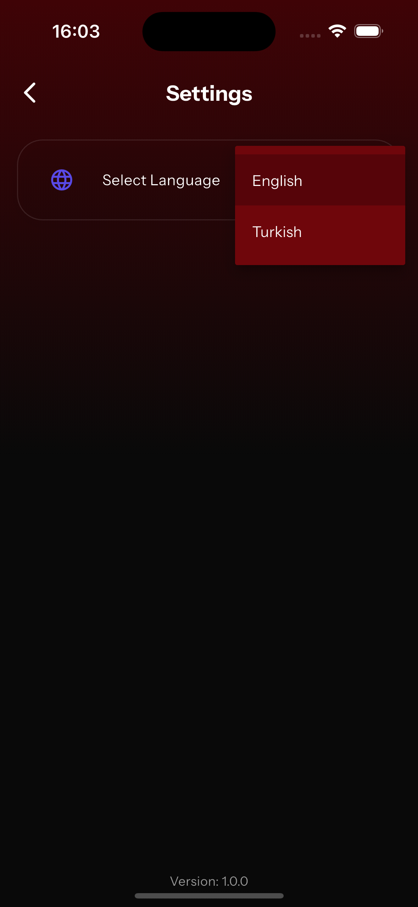

# 🎬 JR Case Flutter Uygulaması

NodeLabs Junior Developer Case Study için hazırlanan bu proje, film kataloğu etrafında şekillenen uçtan uca bir kullanıcı deneyimini sergiliyor. Modern Flutter mimarisi, Riverpod tabanlı durum yönetimi ve Dio destekli ağ katmanı ile gerçek ürün davranışını taklit eden bir case olarak tasarlandı.

## 🎯 Case Özeti

- Splash ekranı ile başlayan deneyim, kimlik doğrulama adımları üzerinden kişiselleştirilmiş içerik akışına ulaşıyor.
- Filmler harici bir API'den çekiliyor; kullanıcılar kaydırmalı akıştan detay sayfalarına geçebiliyor ve favorilerini yönetebiliyor.
- Profil fotoğrafı yükleme, dil tercihi ve bağlantı kontrolü gibi yardımcı akışlar senaryonun parçası.

## 🔄 Kullanıcı Akışı

1. **Splash**: Lottie animasyonu ve marka görünümü.
2. **Giriş / Kayıt**: Validasyonlu formlar, şartlar & koşullar onayı.
3. **Fotoğraf Yükle** (opsiyonel): Profil görseli seçme ve kaydetme.
4. **Ana Akış**: Sonsuz dikey kaydırma ile film kartları.
5. **Film Detayı**: Poster galerisi, teknik bilgiler ve favoriye ekleme.
6. **Profil**: Kullanıcı bilgileri ve favori listesi.
7. **Ayarlar**: EN/TR dil değişimi, sürüm bilgisi.
8. **Bağlantı Kontrolü**: İnternet kesilince özel uyarı ekranı.

## ✨ Öne Çıkan Özellikler

- JWT tabanlı oturum yönetimi ve otomatik token yenileme kontrollü Dio interceptor'ı.
- Riverpod ile ayrışmış provider yapısı; film listesi için sonsuz sayfalama mantığı.
- Favori filmler için yerel durum takibi ve profil ekranında grid görünümü.
- Fotoğraf yükleme akışı: Galeriden seçim, güvenli depolama entegrasyonu.
- Animasyonlu alt navigasyon çubuğu ve özel overlay/toast bileşenleri.
- `connectivity_plus` ile gerçek zamanlı ağ izleme ve yönlendirme.

## 📸 Ekran Görüntüleri

- **Splash**  
  
- **Giriş**  
  
- **Kayıt**  
  
- **Fotoğraf Yükle**  
  
- **Ana Akış**  
  
- **Film Detayı**  
  
- **Profil**  
  
- **Ayarlar**  
  

## 🎥 Demo Videosu

[](https://youtube.com/shorts/hR2DnCVrLRI "YouTube'da izle")


## 🧰 Teknoloji ve Mimari

- **Dil & SDK**: Flutter 3.8, Dart 3.8
- **State Management**: Riverpod, Hooks Riverpod, `riverpod_annotation`
- **Navigasyon**: AutoRoute, özel bottom sheet ve dialog route'ları
- **Veri Katmanı**: Dio + interceptor, Freezed & JsonSerializable modelleri
- **Ağ Bağlantısı Kontrolü**: Connectivity Plus ile internet bağlantısı kontrolü
- **Depolama**: `flutter_secure_storage` ile JWT & kullanıcı tercihleri
- **UI/Animasyon**: Lottie, CachedNetworkImage, özel overlay ve nav bar animasyonları
- **Kod Üretimi**: `build_runner`, `freezed`, `json_serializable`

## 🌐 API ve Veri Akışı

- Taban URL: `https://caseapi.servicelabs.tech/`
- İstekler `DioService` üzerinden geçerek Authorization header'ı otomatik ekleniyor.
- Token süresi dolduğunda kullanıcı giriş ekranına yönlendiriliyor; anlamlı hata mesajları için `CustomException` kullanılıyor.

## 🌍 Lokalizasyon & Ayarlar

- Slang ile EN/TR çevirileri derleniyor (`assets/i18n/en.i18n.json`, `assets/i18n/tr.i18n.json`).
- Ayarlar ekranından seçilen dil `flutter_secure_storage` üzerinden saklanıyor ve uygulamada anında uygulanıyor.

## 🚀 Projeyi Çalıştırma

```bash
git clone <repo-url>
cd jr_case_boilerplate
flutter pub get
flutter run
```
